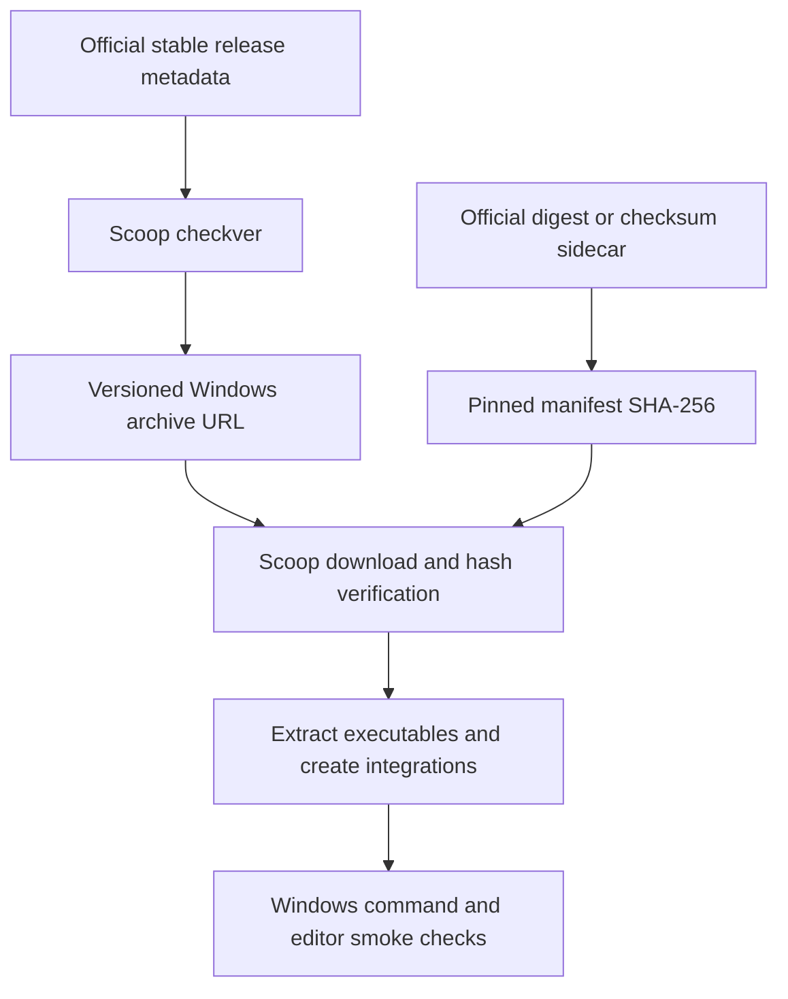

# LimboAI Update and Flow Package - Plan

## Goal Capsule

- **Objective:** Windows x86_64 users can install the latest stable Godot-with-LimboAI editor and Flow Control from this Scoop bucket.
- **Means:** Update the existing LimboAI manifest and add a declarative Flow manifest using official release archives (KTD1, KTD2).
- **Authority:** Requirements govern package behavior; technical decisions govern manifest design; units implement both. Existing repository instructions remain applicable.
- **Execution profile:** Packaging changes with checksum, updater, and Windows runtime smoke verification; no application build or new test framework.
- **Stop conditions:** Missing release assets, conflicting hashes, unexpected archive contents, or failed installation checks block delivery. Do not replace a working installation to investigate an unverified package.
- **Handoff:** Implementation requires a subsequent execution instruction. Committing, pushing, opening a PR, and changing the user's installed packages are not authorized by this plan alone.

---

## Product Contract

### Summary

Update `godot-limboai` when a newer stable release is available and add Flow Control as `flow`, with stable-only update discovery and verified Windows installation behavior.

### Problem Frame

The bucket currently packages LimboAI 1.8.0 with Godot 4.7 and has no Flow package.
Official release metadata identifies a newer LimboAI build and a stable Windows Flow distribution.

### Requirements

**Release selection**

- R1. Both packages track stable upstream releases, excluding drafts, prereleases, nightly builds, and debug artifacts.
- R2. `godot-limboai` advances only when the official stable Windows standard-editor asset is newer; an already-current manifest remains unchanged.

**Package behavior**

- R3. The LimboAI update preserves its `godot-limboai` command, `Godot LimboAI` shortcut, self-contained marker, and persisted `editor_data`.
- R4. The new `flow` package installs the official Windows x86_64 release, exposes the `flow` command, and provides a `Flow Control` shortcut to its GUI executable.
- R5. Flow upgrades preserve existing user configuration and state without relocating them or overwriting profile settings.

**Maintenance and integrity**

- R6. Both manifests pin verified SHA-256 values and resolve future stable versions through Scoop `checkver` and `autoupdate`.
- R7. Delivery includes actual Windows smoke evidence for changed packages and updated repository guidance, not merely JSON parsing or metadata inspection.

### Key Decisions

- **Stable releases only.** Governs R1, R2, R6. (session-settled: user-directed — chosen over including prereleases: the user selected the stable-release scope.)

### Scope Boundaries

Target Windows x86_64, matching the existing bucket.
Upstream Flow ARM64 support is not included in this change.
Do not add nightly packages, .NET Godot variants, language-server bundles, source builds, a CI framework, or unrelated install-hook refactors.
Do not invoke upstream self-installers or self-updaters; Scoop owns the packaged binaries.

---

## Planning Contract

### Release Baseline

Metadata checked on 2026-09-27; neither archive was downloaded or executed during planning.
Recheck the same stable sources at implementation start, because these versions may be superseded before execution.

**LimboAI:** `1.8.0-godot-4.7` becomes `1.8.1-godot-4.7.2`.
The official release is `v1.8.1`, published 2026-08-20, with `prerelease: false`.

- Asset: `limboai+v1.8.1.godot-4.7.2.editor.windows.x86_64.zip`.
- [Official download](https://github.com/limbonaut/limboai/releases/download/v1.8.1/limboai%2Bv1.8.1.godot-4.7.2.editor.windows.x86_64.zip).
- SHA-256: `c6e4516c59eed72de5dd798d78ff8da53b36a2dffabcf5f8aa01467ba88f6c0c`.
- Evidence: [latest stable API](https://api.github.com/repos/limbonaut/limboai/releases/latest) and [release](https://github.com/limbonaut/limboai/releases/tag/v1.8.1).

**Flow:** `0.7.2`, from upstream tag `v0.7.2`, published 2026-02-14, with `prerelease: false`.

- Asset: `flow-v0.7.2-windows-x86_64.zip`.
- [Official download](https://github.com/neurocyte/flow/releases/download/v0.7.2/flow-v0.7.2-windows-x86_64.zip).
- SHA-256: `a8a4f1c6fde1dc79255e58f652d306f8c7fc6697e907733f501e89c86417b4f0`.
- Evidence: [latest stable API](https://api.github.com/repos/neurocyte/flow/releases/latest), [release](https://github.com/neurocyte/flow/releases/tag/v0.7.2), and [checksum sidecar](https://github.com/neurocyte/flow/releases/download/v0.7.2/flow-v0.7.2-windows-x86_64.zip.sha256). The sidecar agrees with the API digest.

### Key Technical Decisions

- KTD1. **Keep the LimboAI updater contract.** The existing asset regex matches the new standard editor and excludes the .NET build. Use its updater to change only the current version, URL, and hash. Preserve named captures, exact-asset digest selection, and installation integration under R2, R3, R6.
- KTD2. **Add `bucket/flow.json` using the official GitHub stable distribution.** Use `architecture.64bit`, MIT license, homepage `https://github.com/neurocyte/flow`, `flow.exe` as the command, and `flow-gui.exe` as the shortcut target. Tagged release packaging and upstream installer source indicate root-level executables, so no `extract_dir`, rename hook, custom installer, or runtime dependency is needed. Verify the actual archive before finalizing these fields.
- KTD3. **Use GitHub stable discovery and Flow's checksum sidecar.** Scoop's `checkver: github` ignores prereleases and obtains the numeric version. The download template follows `v$version/flow-v$version-windows-x86_64.zip`; hash discovery reads the corresponding `.sha256` sidecar. This keeps version, artifact, and checksum on one official host. Codeberg is also official, but mixing its downloads with GitHub metadata adds a mirror-synchronization dependency without helping this bucket.
- KTD4. **Leave Flow's profile data in its native location.** Tagged source resolves configuration through `FLOW_CONFIG_DIR`, `XDG_CONFIG_HOME`, `HOME`, then the Windows `APPDATA` fallback; state has its own XDG/HOME resolution. Do not set these variables or add Scoop `persist` for paths outside the installation. On an ordinary Windows environment the fallback is `%APPDATA%\flow`, not `%APPDATA%\Roaming\flow`.
- KTD5. **Prefer package smoke checks over permanent unit tests.** The repository has no test runner or test files. Exercise real Scoop update/install paths in a disposable environment and verify runtime behavior. Temporary diagnostic scripts must not become committed tests that only assert manifest text or copied values.

### High-Level Technical Design

### Sequencing and Risks

U1 and U2 are independent; their final evidence feeds U3.

- Release pages are mutable. Reconcile metadata, archive bytes, and updater output before accepting a version; do not bypass a checksum failure.
- Scoop may fall back to downloading and hashing when remote hash extraction fails. A successful updater run alone does not prove the intended digest/sidecar lookup worked; inspect its outcome and cross-check the upstream checksum.
- The installed Scoop revision is not pinned. Confirm its `checkver` options and hash normalization rather than assuming the current upstream implementation matches it.
- `flow` may already resolve to another installed command. Inspect command ownership before smoke installation; use isolated Scoop state rather than displacing an unrelated shim.
- Flow's declared static linking and root-level GUI executable are source-grounded expectations, not runtime proof. Unexpected DLL requirements or archive layout block completion until resolved.
- For repository GitHub operations in this task, the user authorized `sh1ny`. Verify the active identity before acting and restore `KintsugiBot` afterward. Commit author and committer identity remain `KintsugiBot`; no publication is implied.

### Sources and Patterns

- `bucket/godot-limboai.json`: four-space JSON, architecture-scoped URL/hash, inline install hook, shim, shortcut, persistence, and exact-asset digest lookup.
- `docs/superpowers/specs/2026-07-10-godot-limboai-1.8.0-upgrade-design.md`: prior updater/idempotence and install-verification guidance; historical target, not a completion record.
- [Flow tagged packaging](https://github.com/neurocyte/flow/blob/v0.7.2/contrib/make_release), [tagged runtime/configuration source](https://github.com/neurocyte/flow/blob/v0.7.2/src/main.zig), and [MIT license](https://github.com/neurocyte/flow/blob/v0.7.2/LICENSE).
- [Flow installation guide](https://flow-control.dev/installation/) and [downloads](https://flow-control.dev/downloads/): official hosts and distinct stable/nightly channels.
- [Scoop manifest reference](https://github.com/ScoopInstaller/Scoop/wiki/App-Manifests) and [autoupdate reference](https://github.com/ScoopInstaller/Scoop/wiki/App-Manifest-Autoupdate): version discovery, sidecar extraction, forced updates, and download-hash fallback.

---

## Implementation Units

### U1. Refresh the Godot-LimboAI package

- **Goal:** Make the current stable standard editor available without changing existing integration.
- **Requirements:** R1, R2, R3, R6, R7.
- **Dependencies:** None.
- **Files:** Modify `bucket/godot-limboai.json` only if the stable comparison requires it. No permanent test file; KTD5 applies.
- **Approach:** Refresh the release baseline, then apply the existing updater under KTD1. Compare downloaded archive bytes with the official exact-asset digest before installation.
- **Patterns:** Preserve all current non-release manifest fields and JSON formatting.
- **Execution note:** Use a disposable installation or protected test copy of persisted data; start with updater and archive checks before replacing any installed package.
- **Test scenarios:**
  1. The newer standard editor resolves to the expected composite version, URL, and SHA-256; no .NET asset is selected.
  2. An already-current manifest remains unchanged, including after repeated forced autoupdate at the same upstream version.
  3. A missing asset or mismatched hash prevents acceptance of the candidate rather than substituting another build.
  4. Installation exposes the command and GUI shortcut, creates `._sc_`, and retains a test `editor_data` sentinel across an upgrade.
  5. The command reports the expected Godot version and the editor exposes LimboAI functionality; artifact provenance identifies the LimboAI release even if the version command does not print it.
- **Verification:** Updater output, byte-level checksum, installed paths, persistence check, and editor smoke evidence satisfy the cited requirements.

### U2. Add the Flow Control package

- **Goal:** Install and update stable Flow through Scoop.
- **Requirements:** R1, R4, R5, R6, R7.
- **Dependencies:** None.
- **Files:** Create `bucket/flow.json`. No permanent test file; KTD5 applies.
- **Approach:**
  1. Inspect the release ZIP and confirm both executable paths against KTD2.
  2. Add the minimal declarative manifest and update rules from KTD2-KTD4.
  3. Compare the downloaded ZIP's SHA-256 with its sidecar and API digest, then exercise the actual Scoop installation.
- **Patterns:** Follow the existing manifest's formatting and architecture block; do not copy LimboAI-specific renaming, self-contained marker, or persistence hooks.
- **Test scenarios:**
  1. A clean installation exposes `flow`; `flow --version` identifies the selected release and `flow --help` works.
  2. The terminal editor opens a disposable text file, saves an edit, and exits; the GUI shortcut opens the packaged GUI executable.
  3. Stable discovery resolves `0.7.2` at the recorded baseline and excludes the separate nightly channel and `-debug` assets.
  4. Forced autoupdate resolves the intended checksum sidecar and is idempotent at the same release.
  5. A package replacement preserves a test configuration/state sentinel outside the install directory without changing environment-variable overrides.
  6. A missing archive or checksum disagreement blocks delivery; an existing unrelated `flow` command is not silently displaced during verification.
- **Verification:** Real updater and Windows smoke results establish R4-R6; metadata alone is insufficient.

### U3. Update repository guidance and record verification

- **Goal:** Keep maintenance instructions accurate for both packages.
- **Requirements:** R7.
- **Dependencies:** U1, U2.
- **Files:** Modify `AGENTS.md`; retain the historical upgrade design unchanged.
- **Approach:** Remove single-package claims, document Flow's command/shortcut and profile-owned data, and distinguish the packages' update/hash strategies. Include actual verification outcomes in the delivery report, not as unexecuted claims in repository guidance.
- **Patterns:** Preserve the existing concise eight-section guidance structure.
- **Test expectation:** None for this documentation-only unit; verify referenced paths and commands against the completed manifests and observed smoke results.
- **Verification:** Guidance describes the delivered bucket without inventing a build system or automated test suite.

---

## Verification Contract

Run these checks during implementation, not planning. Use PowerShell Core and the installed Scoop tooling; there is no repository test, lint, coverage, or `release:validate` target.

| Check | Applies to | Passing evidence |
|---|---|---|
| JSON parsing and Scoop manifest/schema validation | U1, U2 | Both manifests parse and pass the available Scoop validation tooling. |
| `checkver.ps1` with `-Dir .\bucket`, followed by update/forced-update verification | U1, U2 | Stable versions and intended checksum sources resolve; repeating against the same release produces no further change. |
| Downloaded archive SHA-256 comparison | U1, U2 | Actual bytes match the manifest and official checksum metadata. |
| Scoop installation from the local manifest in a disposable environment | U1, U2 | Expected executable paths, shims, and shortcuts are present. |
| `godot-limboai --version`, `flow --version`, `flow --help`, and editor interaction | U1, U2 | Correct versions and usable editors, including a save/reopen check for Flow. |
| Test-data preservation across replacement | U1, U2 | LimboAI persisted data and Flow profile data survive without touching the user's real configuration. |
| Documentation consistency | U3 | Guidance matches the implemented package inventory and verified workflow. |

Keep the previous working installation until candidate verification passes.
If network access, tooling, or an interactive Windows surface prevents a check, report the exact missing evidence and do not label the package fully verified.

---

## Definition of Done

- U1 either delivers the verified newer stable editor or establishes that the existing package is already current without an unnecessary edit.
- U2 delivers an installable `flow` manifest satisfying R4-R6.
- U3 updates guidance to match both packages.
- Verification evidence distinguishes metadata inspection, updater checks, downloaded-byte verification, and runtime observations.
- No temporary archives, smoke scripts, test-profile data, or abandoned implementation attempts remain in the repository diff.
- No unrelated manifest changes, profile migrations, or unauthorized publication occur.
